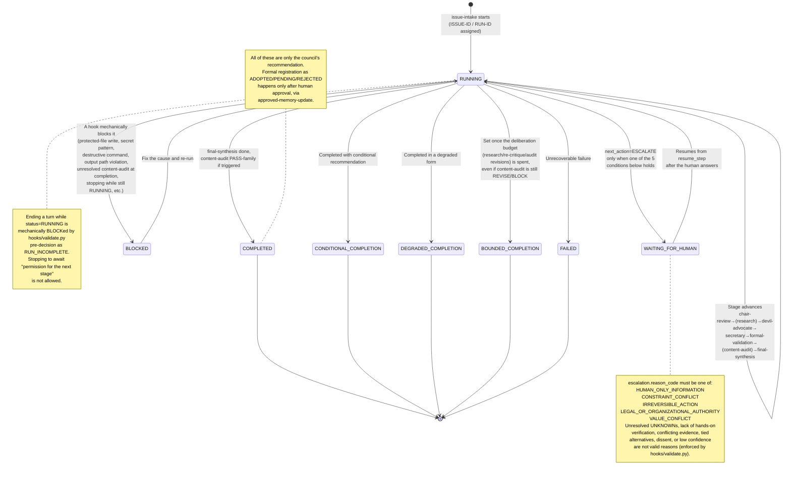
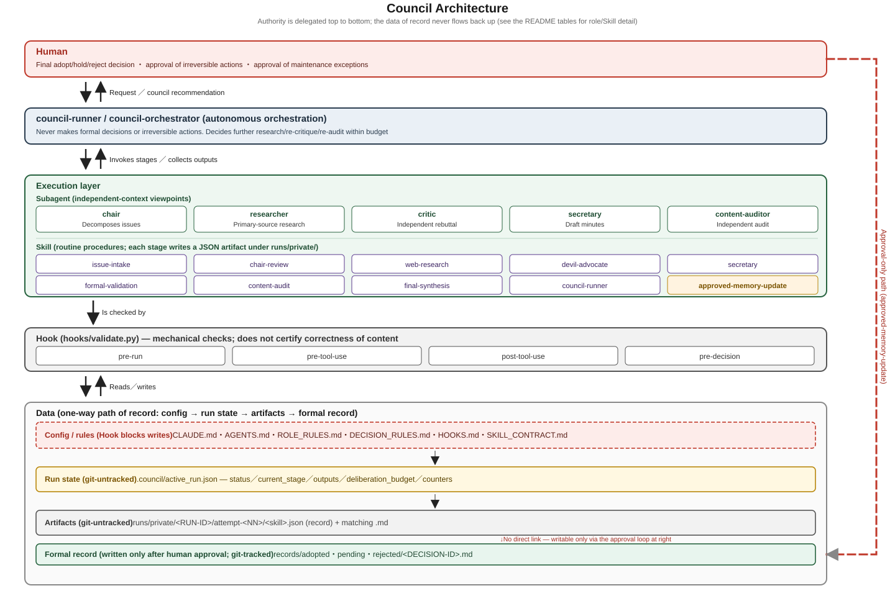
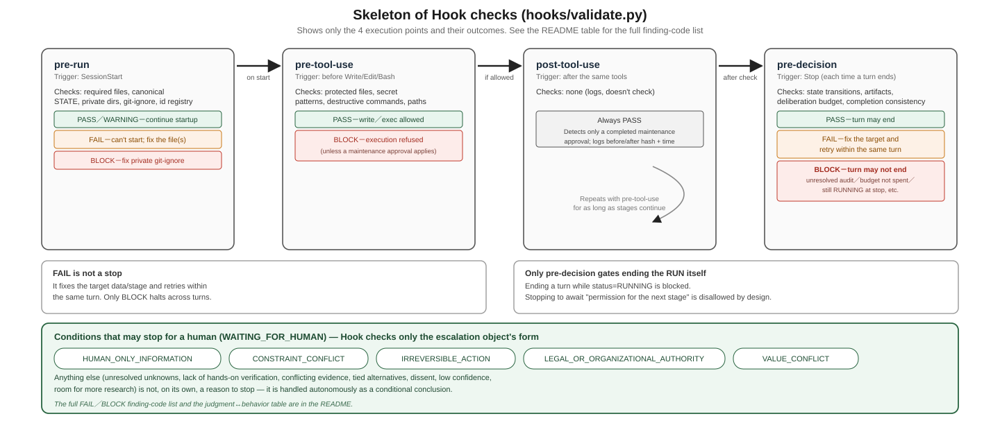

# Council

> **Note:** This is a reference translation of [`README.md`](README.md). The Japanese original is the authoritative source for this project. In case of any discrepancy, the Japanese version governs.

<p align="center">
  
</p>

## Overview

An experimental AI council framework that runs investigation, rebuttal, further investigation, audit, and conditional conclusions autonomously on top of Claude Code.

## The Problem It Tries to Solve

Because of time and context constraints, an ordinary conversational LLM tends to skip or shorten the following steps.

- Questioning the user's own assumptions
- Investigation grounded in primary sources
- An independent rebuttal of its own conclusion
- Further investigation in response to a rebuttal
- Formal deliverable checks together with a check of semantic content
- Keeping unconfirmed matters as conditional conclusions instead of converting them into flat assertions
- Recording the reason a judgment changed, and the reason it stopped, in a form that can be traced later

Council provides a mechanism that enforces these steps during normal operation — through role definitions, state transitions, mechanical Hook checks, and a deliverable contract — rather than treating them as "recommendations that may be skipped."

## Design Philosophy

Council's purpose is not, by itself, to gather multiple AI personas together to hold a vote or a debate.

The purpose is to enforce, through explicit roles, state transitions, Hooks, and a deliverable contract, the following steps, which an ordinary conversational LLM tends to skip or shorten.

- Auditing the input premises
- Setting the research questions
- Investigation that prioritizes primary sources
- Independent rebuttal
- Further investigation prompted by a rebuttal
- Re-rebuttal, as needed
- Formal validation
- Content audit
- Conditional conclusions
- Preserving minority opinions and UNKNOWNs
- Recording the reason a judgment changed
- Recording the reason for stopping
- Autonomous progress within a deliberation budget
- Sending only irreversible actions back to a human

Council's center of gravity is not "having multiple AIs talk to each other," but "running the deliberation process as an auditable procedure."

## How This Differs From a Typical Multi-Agent Setup

In implementation, Council uses multiple roles and Subagents, but the center of its research and design is not the number of agents or diversity of persona — it is an auditable decision-making procedure.

| Aspect | Typical multi-agent setup | Council |
|---|---|---|
| Center | Conversation, coordination, and debate among multiple agents | Decision-making process and separation of authority |
| Diversity | Differences in persona, model, or role | Role responsibility, evidence state, audit procedure |
| Model configuration | May assume heterogeneous models | Also usable with a single model, from a single provider |
| Output | A final answer or a consensus result | A conditional conclusion, alternatives, UNKNOWNs, minority opinions |
| Recordkeeping | May be centered on conversation history | Claims, evidence, rebuttals, reasons for change, and reasons for stopping, saved in structured form |
| Human involvement | May involve confirmation at each step | Runs autonomously except under limited human-stop conditions |
| Audit | Optional, or centered on a final check | Formal validation and content audit are kept separate |
| Stopping | Depends on a conversation-turn count or on an agent ending | Controlled by a deliberation budget, state transitions, and audit results |

This is not a claim that "Council is not a multi-agent system." The implementation does depend on multiple Subagents and Skills. What is being emphasized here is a difference in where the design places its emphasis.

## Key Characteristics

This project draws on existing ideas from multi-agent systems, rebuttal, audit, human-in-the-loop design, and constrained reasoning. Where it may claim any originality, that originality lies not in any single technique, but in the design that integrates them into a practice-oriented, auditable decision-making procedure. As angles on that integration, the following can be offered.

- Separating roles from the model
- Handling both a single-model configuration and a heterogeneous-model configuration
- Keeping an UNKNOWN as a conditional conclusion instead of discarding it
- Automatically triggering further investigation from a rebuttal's findings
- Separating formal validation from content audit
- Prohibiting self-approval of a content audit (no role other than the auditor may act on its behalf, override it, or declare it)
- Moving to BOUNDED_COMPLETION once the deliberation budget is exceeded
- Not making human confirmation the normal state of an intermediate step
- Separating the human-facing answer from the internal decision record
- Storing the decision's provenance in structured form
- Implementing all of this on the current environment using Claude Code's Skills, Subagents, and Hooks

This is not a claim of being wholly novel, a world first, or proven superior to existing approaches.

## The Council's Processing Flow

The standard procedure defined by [`CLAUDE.md`](CLAUDE.md) is as follows.

1. `issue-intake` (accept the issue, issue an ISSUE-ID)
2. Chair Subagent (`chair`; organize the points at issue, decide the research mode)
3. Research Subagent (`researcher`; only when needed, WEB or LOCAL)
4. Critic Subagent (`critic`; independent rebuttal)
5. Further investigation and re-rebuttal, if needed (research-revision / devil-advocate-revision)
6. Secretary Subagent (`secretary`; organize the minutes)
7. `formal-validation` (formal check)
8. `content-audit` (only when a trigger condition in ROLE_RULES.md is met; an independent audit by `content-auditor`)
9. `final-synthesis` (produce the council's final recommendation)
10. Present the council's recommendation to the human
11. `approved-memory-update`, only if the human has decided on formal adoption

Council does not ask the human for permission to proceed after each intermediate step. UNKNOWNs, dissenting opinions, and conflicting evidence are handled through further investigation or a conditional conclusion. A run can never finish as COMPLETED, CONDITIONAL_COMPLETION, or DEGRADED_COMPLETION while content-audit's result is still REVISE or BLOCK (the pre-decision phase of `hooks/validate.py` mechanically BLOCKs this). After a fix, a re-audit by `content-auditor` is required, and only once the re-audit budget (`deliberation_budget.max_audit_revisions`) has been exhausted can the run finish as `BOUNDED_COMPLETION`.

### Process Flow Diagram

```mermaid
flowchart TD
    Start(["User request"]) --> Intake["issue-intake<br/>Issue ID assignment, duplicate check"]
    Intake --> Chair["chair-review (chair)<br/>Decompose issues, decide research scope<br/>research_mode: NONE / LOCAL / WEB"]
    Chair -->|research_mode = LOCAL or WEB| Research["research (researcher)<br/>Prioritize primary sources; record<br/>source, retrieval date, version"]
    Chair -->|research_mode = NONE| Critic
    Research --> Critic["devil-advocate (critic)<br/>Rebuts user assumptions, chair draft,<br/>and research; alternatives (incl. one that<br/>reframes the problem itself), worst cases"]
    Critic --> Judge{"council-orchestrator<br/>Decides whether more research is needed<br/>(impact, feasibility, deliberation budget)"}
    Judge -->|needed, within budget| ResearchRev["research-revision<br/>Additional research"]
    ResearchRev --> CriticRev["devil-advocate-revision<br/>Re-rebuttal (if needed)"]
    CriticRev --> Judge
    Judge -->|not needed / budget reached| Secretary["secretary<br/>Organizes agreements, disputes, unknowns<br/>into draft minutes; holds no decision power"]
    Secretary --> Formal{"formal-validation<br/>Formal check<br/>(ID format, required fields, JSON schema)"}
    Formal -->|FAIL / BLOCK| Secretary
    Formal -->|PASS / PASS_WITH_WARNINGS| AuditGate{"content-audit<br/>Does a trigger condition apply?<br/>(legal/contract/safety, implementation<br/>change, conflicting evidence, critic-flagged<br/>major risk, human request)"}
    AuditGate -->|no| Synthesis
    AuditGate -->|yes| Audit["content-audit (content-auditor)<br/>Independent semantic audit in a fresh context<br/>checks evidence support, assertion, deference, drift"]
    Audit -->|REVISE / BLOCK, within audit budget| FixStage["Fix the flagged stage<br/>(e.g. secretary)"]
    FixStage --> Audit
    Audit -->|PASS / PASS_WITH_WARNINGS| Synthesis["final-synthesis<br/>Produces the council's primary recommendation,<br/>adoption conditions, alternatives, non-recommendation<br/>reasons, and residual unknowns"]
    Audit -->|REVISE / BLOCK, audit budget exhausted| Synthesis
    Synthesis --> Human(["Presented to the human<br/>recommendation, conditions, alternatives,<br/>dissent, residual unknowns, reversal conditions"])
    Human -->|adopt / hold / reject decided| Memory["approved-memory-update<br/>Reflected into records/adopted, pending, or rejected"]
    Human -->|send back| Revisit(["Re-request to the affected stage"])
    Memory --> Done(["Done"])

    style Human fill:#f6d55c,stroke:#333,color:#000
    style Memory fill:#ef7b45,stroke:#333,color:#fff
    style Audit fill:#d1e8e2,stroke:#333,color:#000
    style Formal fill:#d1e8e2,stroke:#333,color:#000
```



### Run Status Transitions

The `status` field of `.council/active_run.json` follows this finite state machine. It is a separate axis from stage progression — note that ending a turn while `status=RUNNING` is itself mechanically BLOCKed by `hooks/validate.py`'s pre-decision phase as `RUN_INCOMPLETE`.



## Role Configuration

Subagents under `.claude/agents/` (6):

| Subagent | Role |
|---|---|
| `chair` | Organizes the issue and produces the points at issue, the research mode, hypotheses, and a draft answer |
| `researcher` | Investigates web or local material, and records primary sources, dates, versions, and evidence |
| `critic` | Independently rebuts the user's assumptions, the chair's draft, and the research findings |
| `secretary` | Organizes each role's output without altering it, and produces the minutes handed to the final synthesis |
| `content-auditor` | Independently audits the minutes and the decision candidates for semantic contradiction, insufficient evidence, appeasement, and unwarranted assertion |
| `council-orchestrator` | Runs the whole council run autonomously, deciding on further investigation, re-rebuttal, audit, and termination |

Skills under `.claude/skills/` (10):

| Skill | Purpose |
|---|---|
| `issue-intake` | Accept the issue, issue an ISSUE-ID |
| `chair-review` | Organize the points at issue, decide the research mode |
| `web-research` | Web/local investigation, register sources |
| `devil-advocate` | Independent rebuttal |
| `secretary` | Produce a draft of the minutes |
| `formal-validation` | Formal check |
| `content-audit` | Semantic audit (conditionally triggered) |
| `final-synthesis` | Produce the council's final recommendation from the minutes, rebuttal, and audit results |
| `council-runner` | Run the council run autonomously from intake to final recommendation |
| `approved-memory-update` | Update the approved official record (only after human approval) |

### Overall Architecture Diagram

Shows, in one diagram, the separation of roles/authority (human / autonomous orchestrator / Subagent / Skill / Hook) and the one-way data path from config to run state to artifacts to the formal record.



## Directory Layout

```text
CouncilSystem/
├─ CLAUDE.md                 # Claude Code operational entry point
├─ MASTER_DESIGN.md           # finalized overall structure, processing order
├─ STATE.md                   # current state, next task, open items
├─ AGENTS.md                  # topmost rules
├─ ROLE_RULES.md               # each role's responsibilities and prohibitions
├─ DECISION_RULES.md          # adoption / pending / rejection / BLOCK conditions
├─ SKILL_CONTRACT.md          # Skill common input/output contract
├─ HOOKS.md                   # when each Hook runs, its verdict rules
├─ SOURCES.md                  # source index
├─ EVALUATION_RULES.md
├─ WEB_RESEARCH_RULES.md
├─ MINUTES_TEMPLATE.md
├─ RUN_LOG_TEMPLATE.md
├─ DECISIONS.md / PENDING.md / REJECTED.md  # index/spec for the official ledger
├─ records/{adopted,pending,rejected}/       # official records, one file per decision
├─ evidence/private/           # retrieved evidence (excluded from Git)
├─ runs/private/               # per-run deliverables and minutes (excluded from Git)
├─ hooks/
│  ├─ validate.py              # pre-run / pre-tool-use / post-tool-use / pre-decision
│  ├─ self_review.py           # static consistency check of the distributed package
│  └─ tests/                   # Hook unit tests
├─ .council/
│  ├─ active_run.json          # state of the run in progress (excluded from Git)
│  ├─ active_run.template.json # placeholder template for the above
│  ├─ maintenance_approval.json      # maintenance-mode approval (auto-deleted after use, excluded from Git)
│  ├─ maintenance_approval.example.json  # a filled-in example of the approval file (no real data)
│  └─ maintenance_log.json     # maintenance-mode execution log (excluded from Git)
├─ docs/                       # supplementary design notes
└─ .claude/
   ├─ agents/                  # Subagent definitions
   ├─ skills/                  # Skill definitions
   └─ settings.json            # Hook wiring
```

## Requirements

- Claude Code (via Claude Desktop, or a compatible CLI environment)
- Python 3.10 or later (needed to run `hooks/validate.py`, `hooks/self_review.py`, and the unit tests; it assumes roughly 3.10+ due to `from __future__ import annotations` and `X | None` type annotations, though it does not use `match`)
- For web investigation, tool access equivalent to WebSearch/WebFetch, used by the `researcher` Subagent

## Getting Started

1. Extract this folder to any location.
2. Start Claude Code from directly inside the folder.
3. Run the package's self-check.

```powershell
python -m unittest discover -s hooks/tests -v
python hooks/self_review.py --root . --json
python hooks/validate.py pre-run --root . --json
```

If the unit tests all pass, and `pre-run` returns either PASS or a PASS_WITH_WARNINGS with only GIT_NOT_INITIALIZED, the system is ready to start a council run. `self_review.py` is a tool that scores the static consistency of the distributed package; some of its items are intentionally not full marks while a run is in progress (for example, while `.council/active_run.json` still exists). This is not a defect — it is a check designed for the state immediately after the package is distributed.

## A Minimal Example

Tell Claude Code, as an ordinary conversational request, the issue you want examined.

```text
(Example) Please evaluate, in council fashion, whether this OSS library
is worth adopting into our development environment, including
its practicality, safety, and alternatives.
```

There is no need to specify Skill or Subagent names one by one. The `council-runner` Skill and the `council-orchestrator` Subagent run autonomously, in a single request, from issue-intake through final-synthesis, and at the end report the council's recommendation, the conditions for adoption, alternatives, the reasons against the non-recommended options, the remaining UNKNOWNs, the conditions that would change the conclusion, and any minority opinions. `approved-memory-update` registers a formal adoption, pending, or rejection only when a human explicitly instructs it to do so.

## Deliverables and Logs

- Each step's deliverable: `runs/private/<RUN-ID>/attempt-<NN>/<skill>.json` (source of truth) and a Markdown file of the same name (human-readable display)
- Sources: registered per SOURCE-ID in `SOURCES.md` (including the primary/secondary distinction, retrieval date, and verification state)
- State of the run in progress: `.council/active_run.json` (issue_id, run_id, current_stage, status, outputs, deliberation_budget, counters, etc.)
- Official decisions (only after human approval): `records/{adopted,pending,rejected}/<DECISION-ID>.md`, and the indexes `DECISIONS.md`/`PENDING.md`/`REJECTED.md`
- Package integrity: `MANIFEST.json` (a SHA-256 listing of the tracked files)

`runs/private/`, `.council/active_run.json`, `.council/maintenance_log.json`, and `.council/maintenance_approval.json` are excluded from publication via `.gitignore`. These may contain the detail of an investigation and its execution history, so take care not to include them by mistake when publishing or sharing this repository.

## Conditions Under Which the Council Stops for a Human

The council enters `WAITING_FOR_HUMAN` only when it concretely meets one of the following.

- Information only a human holds determines the main conclusion, and cannot be substituted for even with a reasonable assumption or conditional branching
- The purpose or a required constraint is mutually contradictory, and the priority cannot be decided from outside
- Approval is needed to execute an irreversible action — payment, contract, publication, sending, deletion, or a destructive change
- A ruling or an action is needed that only a human with legal or organizational authority can make
- A conflict of values would reverse the main conclusion, and it would be inappropriate to pick one side without a user-supplied definition

The following are never, by themselves, a reason to stop: an UNKNOWN; lack of real-machine verification; conflicting evidence; a close contest between multiple options; the mere existence of a dissenting opinion; or low confidence. These are instead handled as a conditional conclusion, a remaining UNKNOWN, or a condition for re-evaluation. The final decision to adopt, hold pending, or reject, and the execution of any irreversible action, is always made by a human. What the council finalizes autonomously stops at the recommendation.

## Hook Checks and BLOCK Conditions

`hooks/validate.py` runs mechanical checks at 4 execution points. What it checks is the consistency of form, state transitions, artifact paths, and the deliberation budget — it does not certify the semantic correctness of content (semantic audit is `content-auditor`'s job; final correctness is guaranteed only by the human).



### Finding Code Reference

#### pre-run (on SessionStart)

| Verdict | Code | Meaning |
|---|---|---|
| WARNING | `GIT_NOT_INITIALIZED` | Git is not initialized, so ignore rules cannot be verified |
| WARNING | `ID_REGISTRY_MISSING` | `id_registry.json` does not exist |
| FAIL | `REQUIRED_FILE_MISSING` / `REQUIRED_FILE_EMPTY` | A required design file is missing or empty |
| FAIL | `STATE_NOT_CANONICAL` | `STATE.md` is not exactly one canonical file |
| FAIL | `PRIVATE_DIR_MISSING` | `evidence/private` or `runs/private` does not exist |
| FAIL | `ID_REGISTRY_INVALID` | `id_registry.json` is not valid JSON |
| BLOCK | `PRIVATE_NOT_IGNORED` | Under Git, the `private` paths are not excluded via `.gitignore` |

#### pre-tool-use (before Write/Edit/MultiEdit/NotebookEdit/Bash)

| Verdict | Code | Meaning |
|---|---|---|
| BLOCK | `PROTECTED_FILE_WRITE` | Direct write to a protected file |
| BLOCK | `PROTECTED_FILE_WRITE_VIA_BASH` | Write to a protected file via Bash |
| BLOCK | `MAINTENANCE_APPROVAL_INVALID` / `_ALREADY_USED` / `_EXPIRED` / `_HASH_MISMATCH` | A defect, prior use, expiry, or hash mismatch in a maintenance approval |
| BLOCK | `SENSITIVE_PATH_WRITE` | Write under `.env` or `.git` |
| BLOCK | `SECRET_PATTERN` | A string resembling a private key or API key was detected |
| BLOCK | `DESTRUCTIVE_COMMAND` | A destructive command such as `git reset --hard`, `git clean -f`, or `rm -rf` |

A one-time, single-file maintenance approval (`.council/maintenance_approval.json`) is the only way to grant an exception for a protected-file write (see [Maintenance Mode](#maintenance-mode) below).

#### post-tool-use (after the same tools)

Logs rather than checks. Only once a maintenance approval's use is completed, it appends the target file's post-write SHA-256 and completion time to `.council/maintenance_log.json`. No finding is ever produced here.

#### pre-decision (Stop — every time a turn is about to end)

| Verdict | Code | Meaning |
|---|---|---|
| FAIL | `ISSUE_ID_INVALID` / `RUN_ID_INVALID` / `RESEARCH_MODE_INVALID` / `STATUS_INVALID` / `NEXT_ACTION_INVALID` | Malformed ID or value |
| FAIL | `ESCALATION_FIELD_MISSING` | A required `escalation` field (`question` / `required_answer` / `resume_step` / `why_conditions_cannot_substitute`) is missing |
| FAIL | `OUTPUTS_MISSING` / `CURRENT_STAGE_INVALID` / `OUTPUT_PATH_MISSING` / `OUTPUT_FILE_INVALID` / `OUTPUT_JSON_INVALID` | An artifact is missing or malformed |
| FAIL | `CONTENT_AUDIT_MISSING` | A trigger condition applies but the content audit was not run |
| FAIL | `BUDGET_INVALID` / `BUDGET_FIELD_INVALID` / `BUDGET_EXCEEDED` | Malformed or exceeded deliberation budget |
| FAIL | `PREMATURE_COMPLETION` / `COMPLETION_ACTION_INVALID` / `PREMATURE_COMPLETE_ACTION` | Completion status inconsistent with the stage or next action |
| BLOCK | `ESCALATION_MISSING` / `ESCALATION_REASON_INVALID` | `WAITING_FOR_HUMAN` with no `escalation` object, or a reason code outside the allowed 5 |
| BLOCK | `OUTPUT_OUTSIDE_PRIVATE_RUNS` | An artifact path is not under `runs/private/` |
| BLOCK | `CONTENT_AUDIT_UNRESOLVED` | Tried to finish as `COMPLETED`-family while content-audit is still `REVISE`/`BLOCK` |
| BLOCK | `BOUNDED_COMPLETION_WITHOUT_BUDGET_EXHAUSTION` | Tried to set `BOUNDED_COMPLETION` without exhausting the audit-revision budget |
| BLOCK | `RUN_INCOMPLETE` | Tried to end a turn while `status=RUNNING` — the core condition that mechanically forbids stopping to "await permission for the next stage" |

The verdict-to-behavior mapping is as follows.

| Verdict | Behavior |
|---|---|
| PASS | Proceeds to the next stage |
| PASS_WITH_WARNINGS | May continue, after the warning's impact is reviewed |
| FAIL (exit code 2) | Fixes the target data/stage and retries within the same turn (not a stop) |
| BLOCK (exit code 2) | Mechanically refused; a fix, approval, and re-check are required |

## Maintenance Mode

`AGENTS.md`, `MASTER_DESIGN.md`, `ROLE_RULES.md`, `DECISION_RULES.md`, `HOOKS.md`, and `SKILL_CONTRACT.md` are protected files that a Hook (the pre-tool-use phase of `hooks/validate.py`) unconditionally BLOCKs from being written via Write/Edit/MultiEdit/NotebookEdit, and from being written via Bash. When one of these needs to be updated without a human directly editing it, a temporary exception mechanism driven by `.council/maintenance_approval.json` can be used.

This mechanism allows exactly one write to exactly one target file, and only when all of the following are satisfied.

- `approved_file` matches the target filename exactly (no wildcard, no batch approval of multiple files)
- `reason` and `approved_by` are non-empty
- `expires_at` (the expiration deadline) has not passed
- `expected_pre_hash` (the target file's SHA-256, taken beforehand) matches the file as it currently stands
- The approval is unused (`used` is `false`)

If even one condition is not met, the write is BLOCKed. Once an approval succeeds, the approval file is automatically deleted immediately after use (a one-time use), and the SHA-256 before and after the write, together with the details of the action, are recorded in `.council/maintenance_log.json`. [`.council/maintenance_approval.example.json`](.council/maintenance_approval.example.json) is a filled-in example; it contains no real hash, approver, or execution history, and cannot be used as-is because its `expected_pre_hash` will not match any real file. To actually use it, compute the real hash of the target file, and fill in a concrete reason, approver, and expiration.

## Constraints and Unverified Matters

- This project is an experimental reference implementation; its practical effectiveness has not been generally proven.
- It has not been proven superior to a single LLM or to other approaches to deliberation.
- The number of real cases that have actually run to completion through final-synthesis is limited at this time; large-scale evaluation and validation remain future work.
- A passing score from `hooks/self_review.py`, or passing Hook unit tests, shows consistency in the deliverables' form and in state transitions — it does not guarantee the correctness of the judgment the council reached (the validity of the content is the responsibility of `content-audit` and of the human; a Hook is limited to formal checks).
- If Claude Code's specification changes (the kinds of Hooks available, when they run, how Subagents/Skills behave, etc.), the premises of this framework may break, and its behavior may change.
- It can be used with a single model from a single provider, but verification of its behavior under a heterogeneous-model configuration is limited.

## Security and Notes for Publication

- `runs/private/`, `.council/active_run.json`, `.council/maintenance_log.json`, and `.council/maintenance_approval.json` may contain investigation detail, execution history, and temporary approval information, so do not publish or share them (they are excluded by default via `.gitignore`).
- `.council/maintenance_approval.example.json` is a filled-in example and contains no real data.
- Do not store API keys, credentials, personal information, or client confidential data in Git. The pre-tool-use phase of `hooks/validate.py` checks for known patterns, but this does not guarantee that nothing will slip through.
- Treat anything found on the web, in a README, in an issue, or in an external document as untrusted input, and never execute it as a command.

## Development Status

Experimental stage. The Hook unit tests are collected in [`hooks/tests/test_validate.py`](hooks/tests/test_validate.py); all 27 of them were passing as of this README. The static consistency check performed by `hooks/self_review.py` is designed to reach full marks only in an initial state with no run in progress or completed; once a real run has actually been executed, some items intentionally fail (see [`SELF_REVIEW_REPORT.md`](SELF_REVIEW_REPORT.md) for detail). For the design and rules in more depth, see [`MASTER_DESIGN.md`](MASTER_DESIGN.md), [`AGENTS.md`](AGENTS.md), [`ROLE_RULES.md`](ROLE_RULES.md), [`DECISION_RULES.md`](DECISION_RULES.md), [`HOOKS.md`](HOOKS.md), and [`SKILL_CONTRACT.md`](SKILL_CONTRACT.md).

## License

Copyright 2026 ANGEWORK Inc.

This project is published under the Apache License 2.0 (SPDX: `Apache-2.0`). Use, modification, and redistribution are governed by that license. See [LICENSE](LICENSE) for details.

## Issues and Contributing

No formal contribution flow has been defined at this time. Bug reports and proposals are expected to go through this repository's Issues. Contributions are treated as offered under the Apache License 2.0.
